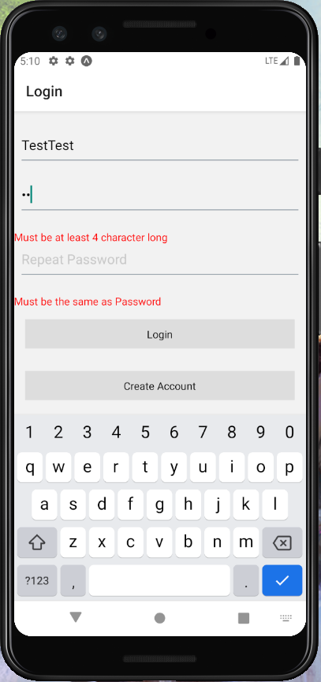
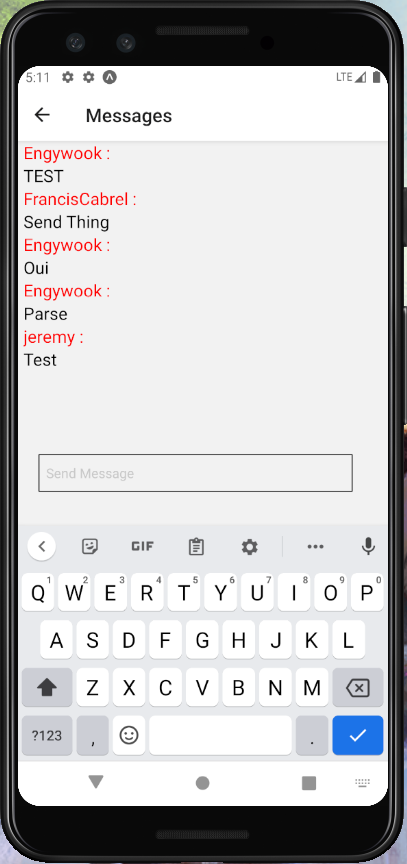

# beacon
School project : messenger app with React Native

The app is composed of two screens :

**The login and register screen**

**And the chat screen**

The messages are retrieved once through the API and then are added in live with a WebSocket
